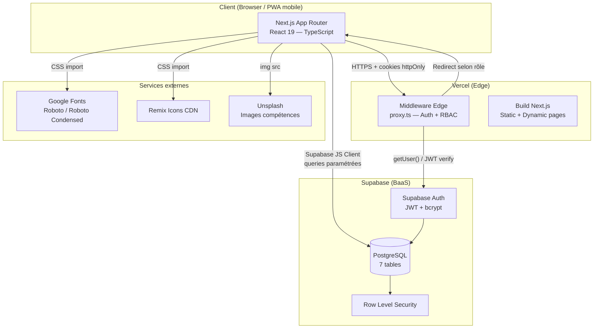

# RugbyCoach — RCACP 95

[](https://rugby-coach-liard.vercel.app)

> Application web de gestion de performance pour entraîneur de rugby senior.  
> Pilotez votre effectif, analysez chaque joueur match par match sur 22 compétences rugby, et offrez à vos joueurs un portail de suivi personnalisé.

**🔗 Démo en ligne :** [rugby-coach-liard.vercel.app](https://rugby-coach-liard.vercel.app)  
**Compte démo coach :** `matthieu2422@gmail.com` / `Demo1234!` *(à créer via seed — voir section Lancer en local)*

---

## Spécifications fonctionnelles

### Pitch

Les entraîneurs de rugby amateur passent des heures à gérer leurs équipes dans des Excel éparpillés, sans vision globale de la progression de leurs joueurs. **RugbyCoach** centralise gestion de l'effectif, suivi médical, résultats de matchs et évaluation individuelle sur 22 compétences dans une application mobile-first pensée pour l'entraîneur solo.

### Personae cibles

| Persona | Description |
|---------|-------------|
| **Le Coach** | Entraîneur senior d'un club amateur (RCACP 95), seul, qui suit 20-30 joueurs toute la saison |
| **Le Joueur** | Joueur senior qui veut accéder à ses stats, ses notes coach et ses axes d'amélioration |

### MVP — Cas d'usage couverts

**Coach :**
1. En tant que coach, je veux me connecter de façon sécurisée afin d'accéder à mes données sans exposer mes joueurs.
2. En tant que coach, je veux gérer mon effectif (ajouter, modifier, archiver des joueurs) afin d'avoir toujours une liste à jour.
3. En tant que coach, je veux planifier des matchs et saisir les scores afin de suivre le bilan de la saison.
4. En tant que coach, je veux saisir les stats individuelles (essais, plaquages, minutes…) après chaque match afin d'objectiver les performances.
5. En tant que coach, je veux noter chaque joueur sur 22 compétences rugby (A/B/C/D) après chaque match afin d'avoir un suivi structuré.
6. En tant que coach, je veux accéder aux pages conseil de chaque compétence afin de m'appuyer sur du contenu expert pour guider mes joueurs.
7. En tant que coach, je veux gérer le suivi médical (blessures, statut out/incertain) afin de préparer mes compositions.
8. En tant que coach, je veux planifier mes séances d'entraînement afin d'organiser mon calendrier.
9. En tant que coach, je veux inviter mes joueurs sur l'application afin qu'ils puissent accéder à leur portail personnel.

**Joueur :**
10. En tant que joueur, je veux accéder à mon portail personnel afin de voir mes stats et ma progression.
11. En tant que joueur, je veux voir mes évaluations par compétence match après match afin de comprendre ce que mon coach pense de moi.
12. En tant que joueur, je veux accéder aux pages conseil des compétences où je suis le moins bien noté afin de progresser concrètement.

### Out of scope

- Composition d'équipe drag & drop (terrain interactif)
- Messagerie coach ↔ joueurs
- Intégration GPS / données physiques (Catapult, GPS vests)
- Gestion multi-équipes / multi-clubs
- Export PDF de rapport de match

### Parcours utilisateur principal (Coach)

1. **Login** → `/` — saisie email + mot de passe
2. **Dashboard** → `/dashboard` — vue globale : compte à rebours prochain match, bilan saison, infirmerie, derniers matchs
3. **Effectif** → `/effectif` — liste des joueurs actifs avec filtres par poste
4. **Fiche joueur** → `/joueur/[id]` — stats agrégées, radar SVG des 22 compétences, historique évaluations
5. **Matchs** → `/matchs` — saisie résultat + stats individuelles + évaluations A/B/C/D joueur par joueur
6. **Compétences** → `/competences` → `/competences/[slug]` — 22 fiches conseil détaillées
7. **Santé** → `/sante` — suivi médical, statuts blessures
8. **Inviter joueurs** → `/joueurs/inviter` — création comptes joueurs avec mot de passe temporaire

---

## Architecture



### Choix techniques justifiés

**Next.js 16 (App Router)**  
Choisi pour la gestion SSR/SSG des pages publiques (compétences) et pour le middleware Edge natif qui permet de vérifier le JWT Supabase côté serveur avant de servir n'importe quelle page. L'alternative Vite + React SPA aurait exposé toutes les routes côté client sans protection serveur. Inconvénient accepté : build légèrement plus complexe et courbe d'apprentissage App Router vs Pages Router.

**Supabase (BaaS)**  
Remplace un backend Node/Express + PostgreSQL autogéré. Fournit l'authentification (JWT, bcrypt géré), la base de données PostgreSQL, le client JS typé et les Row Level Security policies. L'inconvénient est la dépendance à un service tiers et des limitations RLS qui nécessitent une attention particulière pour l'isolation des données joueur/coach.

**TypeScript**  
Typage statique sur tout le projet (interfaces `Joueur`, `Match`, `Evaluation`, `Competence`). Permet le refacto en confiance et évite les erreurs de propriété undefined qui pullulent dans les apps rugby (stats optionnelles, joueurs partiellement renseignés). Inconvénient : configuration tsconfig + types Supabase à maintenir.

**Tailwind CSS v4**  
Utilisé en complément d'un design system CSS custom (variables dans `globals.css`). Tailwind pour les utilitaires de layout, CSS custom pour les tokens de couleur/typo identitaires (palette RCACP). L'alternative CSS-in-JS (styled-components) aurait alourdi le bundle et n'apportait rien pour une app mobile-first à design fixe.

**Vercel**  
Déploiement CD automatique sur push `main`. TLS automatique, CDN global, support natif Next.js. Alternative Render ou Fly.io aurait demandé un Dockerfile. Inconvénient : lock-in vendor léger, limites du plan gratuit sur les Edge Functions.

### Limites connues

- **RLS permissive** : la policy `evaluations` est `USING (true)` — un joueur authentifié peut lire toutes les évaluations via l'API Supabase directe. À corriger avant mise en production réelle.
- **Pas d'API routes Next.js** : toute la couche données passe par le client Supabase directement depuis le navigateur. Acceptable pour un usage mono-coach, mais pas scalable.
- **Pas de tests automatisés** : aucun test unitaire ou e2e. La validation est manuelle.
- **Config.js legacy** : l'ancien prototype vanilla JS (`assets/`) est encore dans le repo mais n'est pas utilisé par l'app Next.js.
- **Seed manuel** : les données de démo doivent être insérées via le fichier `seed.sql` dans Supabase — pas de commande CLI automatisée.

---

## Stack

| Techno | Version | Rôle |
|--------|---------|------|
| Next.js | 16.2.4 | Framework fullstack (App Router) |
| React | 19.2.4 | UI |
| TypeScript | 5.x | Typage statique |
| Tailwind CSS | 4.x | Utilitaires CSS |
| Supabase | 2.50.0 | Auth + PostgreSQL + BaaS |
| @supabase/ssr | 0.6.1 | Middleware Edge + cookies |
| Vercel | — | Hébergement + CD |

---

## Lancer en local

### Prérequis
- Node.js ≥ 20
- npm ≥ 10
- Compte Supabase (gratuit sur [supabase.com](https://supabase.com))

### Étapes

```bash
# 1. Cloner le repo
git clone https://github.com/Plantorfr/RUGBY-COACH.git
cd RUGBY-COACH

# 2. Installer les dépendances
npm install

# 3. Configurer les variables d'environnement
cp .env.example .env.local
# → Remplir NEXT_PUBLIC_SUPABASE_URL et NEXT_PUBLIC_SUPABASE_ANON_KEY
#   (Supabase Dashboard > Project Settings > API)

# 4. Initialiser la base de données
# → Aller dans Supabase Dashboard > SQL Editor
# → Coller et exécuter le contenu de supabase-migration.sql
# → Puis coller et exécuter seed.sql pour les données de démo

# 5. Lancer le serveur de dev
npm run dev
# → App disponible sur http://localhost:3000
```

### Compte de démo (après seed)
- **Coach** : `coach@demo-rcacp.fr` / `Demo1234!`
- **Joueur** : `joueur@demo-rcacp.fr` / `Demo1234!`

---

## Variables d'environnement

| Variable | Rôle | Exemple | Requise |
|----------|------|---------|---------|
| `NEXT_PUBLIC_SUPABASE_URL` | URL du projet Supabase | `https://xxx.supabase.co` | ✅ |
| `NEXT_PUBLIC_SUPABASE_ANON_KEY` | Clé publique Supabase (anon) | `eyJhbGci...` | ✅ |

> ⚠️ La clé `ANON_KEY` est une clé **publique** Supabase (JWT role=anon), conçue pour être exposée côté client. Elle ne donne accès qu'aux données autorisées par les policies RLS. Ne jamais committer la `service_role` key qui elle est secrète.

---

## Structure du projet

```
app/
├── page.tsx                    # Login
├── dashboard/page.tsx          # Dashboard coach
├── effectif/page.tsx           # Gestion effectif
├── joueur/[id]/page.tsx        # Fiche joueur + radar compétences
├── matchs/page.tsx             # Matchs + saisie stats + évaluations
├── sante/page.tsx              # Suivi médical
├── seances/page.tsx            # Séances d'entraînement
├── competences/page.tsx        # Liste 22 compétences
├── competences/[slug]/page.tsx # Fiche conseil par compétence
├── evaluations/[joueurId]/     # Formulaire évaluation coach
├── portail/page.tsx            # Dashboard joueur
├── portail/mes-evaluations/    # Historique évals (vue joueur)
└── joueurs/inviter/page.tsx    # Invitation joueurs
components/
├── BottomNav.tsx               # Navigation coach
└── BottomNavPlayer.tsx         # Navigation joueur
lib/
├── supabase.ts                 # Client Supabase
└── competences.ts              # 22 compétences + contenu expert
proxy.ts                        # Middleware Edge (auth + RBAC)
supabase-migration.sql          # Schéma BDD
seed.sql                        # Données de démonstration
```

---

## Choix techniques détaillés

Voir la section [Architecture](#architecture) ci-dessus.

---

## Limites connues & TODO

- [ ] Corriger les policies RLS pour isoler les données par joueur
- [ ] Ajouter des API routes Next.js pour centraliser la logique serveur
- [ ] Ajouter tests unitaires (Jest + Testing Library)
- [ ] Composition d'équipe drag & drop (terrain 15 positions)
- [ ] Export PDF rapport post-match
- [ ] Domaine personnalisé

---

## License

MIT — Projet académique B3 Oteria 2025/2026
