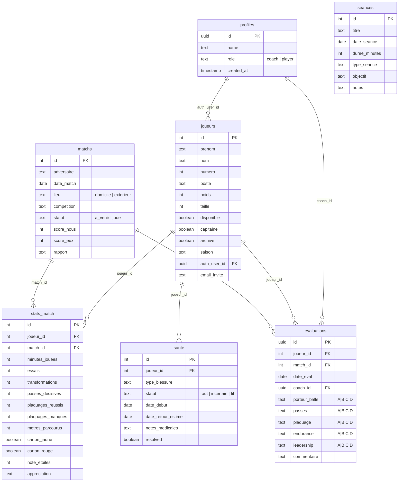

# Schéma base de données — RugbyCoach RCACP 95

## Diagramme ER

## Description des tables

| Table | Rôle | Lignes estimées |
|-------|------|-----------------|
| `profiles` | Profils utilisateurs (coach + joueurs) | < 30 |
| `joueurs` | Effectif du club (actifs + archivés) | 20-50 |
| `matchs` | Calendrier des matchs | 20-40/saison |
| `stats_match` | Stats individuelles par match | 300-600/saison |
| `evaluations` | Notes A/B/C/D sur 22 compétences | 400-800/saison |
| `sante` | Historique des blessures | 10-50/saison |
| `seances` | Séances d'entraînement planifiées | 50-100/saison |

## Indexes

| Index | Table | Colonne(s) | Justification |
|-------|-------|-----------|---------------|
| `idx_joueurs_archive` | joueurs | archive | Filtre principal (actifs vs archivés) |
| `idx_joueurs_auth_user` | joueurs | auth_user_id | Lookup joueur depuis user Supabase |
| `idx_matchs_statut` | matchs | statut | Filtre à_venir/joué |
| `idx_matchs_date` | matchs | date_match DESC | Tri chronologique |
| `idx_stats_match_joueur` | stats_match | joueur_id | JOIN avec joueurs |
| `idx_stats_match_match` | stats_match | match_id | JOIN avec matchs |
| `idx_evaluations_joueur` | evaluations | joueur_id | Historique par joueur |
| `idx_evaluations_match` | evaluations | match_id | Évals d'un match |
| `idx_sante_resolved` | sante | resolved | Filtre blessures actives |

## RLS (Row Level Security)

Toutes les tables ont RLS activé. Règle générale :
- **Coach** (`profiles.role = 'coach'`) → accès total (SELECT/INSERT/UPDATE/DELETE)
- **Joueur** → SELECT uniquement sur ses propres données (via `auth_user_id`)
- **matchs et seances** → SELECT pour tous les utilisateurs authentifiés
